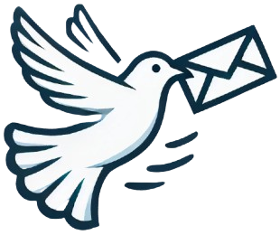

<div align="center">
  
  <h1>DelConnect</h1>
</div>

<div align="center">
  
  
  
</div>

<br />

<div align="center">
  
  
  
</div>

<br />

<p align="center">
  <strong>Building a community and facilitating communication among individuals at the Del Institute of Technology campus.</strong>
</p>

## Executive Summary

**DelConnect** is an integrated mobile application (Android & iOS) designed specifically to build and facilitate communication within the Institut Teknologi Del community. This app allows users to share stories, interact in real-time, and manage their digital profiles using a scalable cloud backend architecture. It provides a modern, centralized, and seamless user experience for the entire academic community.

## Key Features

- **Social Feed & Posting**: Users can create, share, and view posts (text and images) from the community in a real-time feed with infinite scrolling/pull-to-refresh capabilities.
- **Real-Time Interaction**: Engage with community content through likes and direct messaging.
- **Push Notifications**: Stay updated with instant pop-up notifications for new messages and interactions.
- **Theming**: Integrated Dark and Light modes that respect user preferences for a comfortable viewing experience.
- **Secure Authentication**: Supports secure login and registration using Email/Password and Google Sign-In.

---

## Tech Stack & Core Systems

| Category | Technology |
| --- | --- |
| **Mobile App Frontend** | Flutter (Dart ≥3.0.0) |
| **Database & Real-time** | Firebase Cloud Firestore |
| **Authentication** | Firebase Auth + Google Sign-In |
| **Media Storage** | Supabase Storage |
| **Push Notifications** | Firebase Cloud Messaging (FCM) |
| **State Management** | Provider |

---

## Project Structure

This project follows a feature-based architecture typical for scalable Flutter applications:

```text
delconnect/
├── android/               # Application configuration directory for the Android platform
├── ios/                   # Application configuration directory for the iOS platform
├── assets/                # Static application assets (images, icons, fonts, etc.)
├── lib/                   # Main Flutter application source code
│   ├── constants/         # App-wide constants (themes, colors, text styles)
│   ├── providers/         # State management providers (Theme, Navigation)
│   ├── routes/            # App routing configurations
│   ├── screens/           # UI Screens (Home, Explore, Search, Profile, Messages, etc.)
│   ├── services/          # External services APIs (Firebase, Supabase, Notifications)
│   ├── widgets/           # Global and reusable UI components (Bottom Navigation, Custom Buttons)
│   └── main.dart          # Application entry point
├── pubspec.yaml           # Flutter package configuration & dependencies file
├── application-desc.md    # Detailed functional and non-functional project description
└── README.md              # Main project guide & documentation file
```

---

## How to Run the Application

The DelConnect application is built natively for mobile platforms using the Flutter SDK.

### System Prerequisites
Ensure your operating system has the following installed:
- [Flutter SDK](https://flutter.dev/) (version 3.0.0 or above)
- [Android Studio](https://developer.android.com/studio) (for Android emulation & build tools)
- [Xcode](https://developer.apple.com/xcode/) (for iOS emulation - macOS only)
- Physical Device or Simulator/Emulator.

---

### Running Manually (Development Mode)

1. Open a terminal in the root folder of this project.
2. Install Dart dependencies:
   ```bash
   flutter pub get
   ```
3. Generate required Podfiles for Apple targets (macOS / iOS developers only):
   ```bash
   cd ios
   rm -f Podfile.lock
   rm -rf Pods
   pod install --repo-update
   cd ..
   ```
4. Set up Environment Variables or Keys:
   *(Make sure the required Firebase Configs such as `google-services.json` and `GoogleService-Info.plist` are correctly placed in the `android/app/` and `ios/Runner/` folders respectively).*
5. Run the application:
   ```bash
   flutter run
   ```

---

## Development Team

This platform is developed by:
- **Jody Edriano Pangaribuan** - Developer

<br />

> **License**: © 2026 DelConnect | Developed by Jody. All rights reserved.
